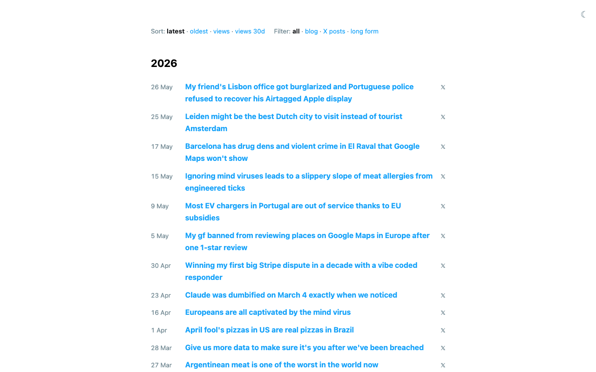
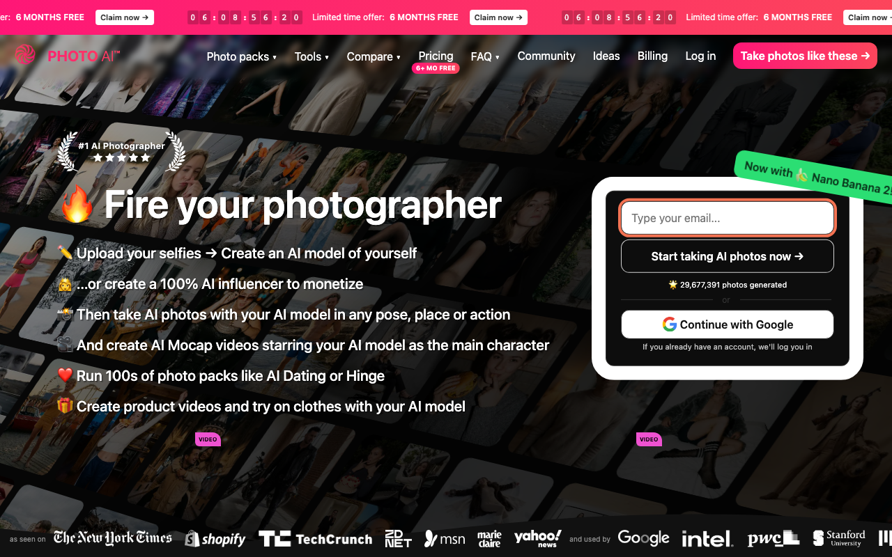
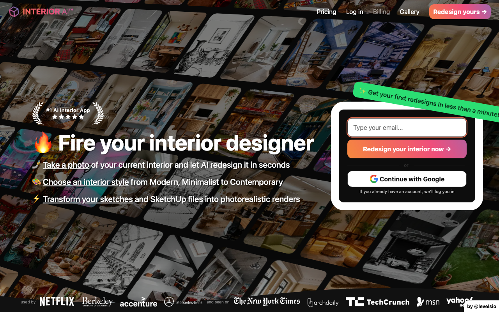
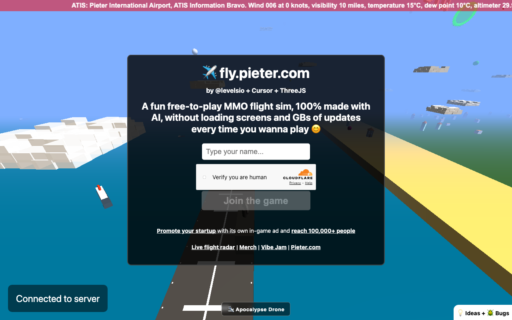
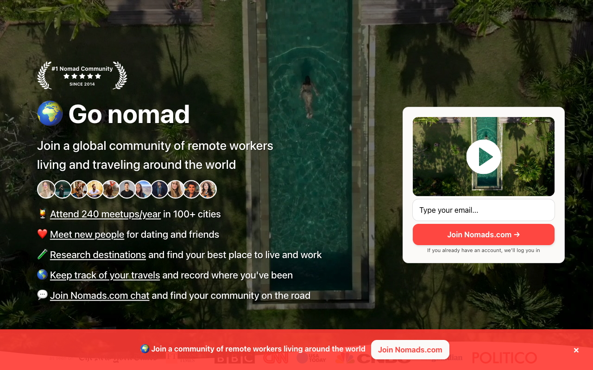
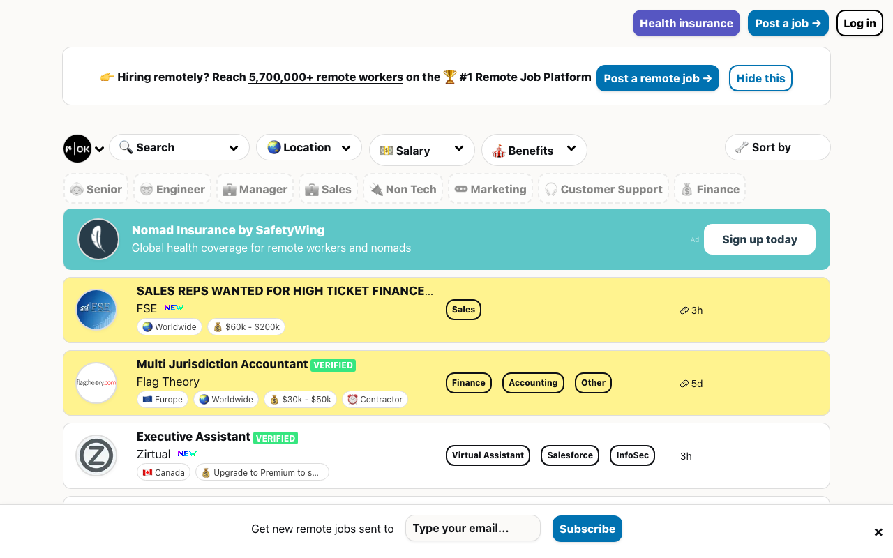
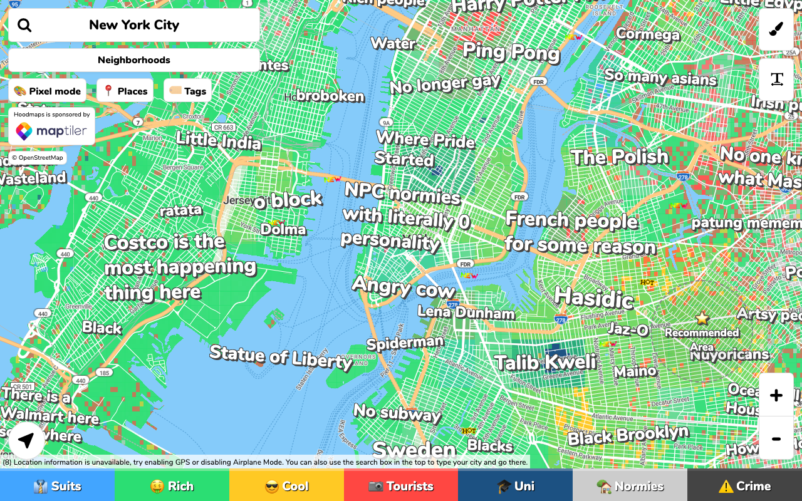
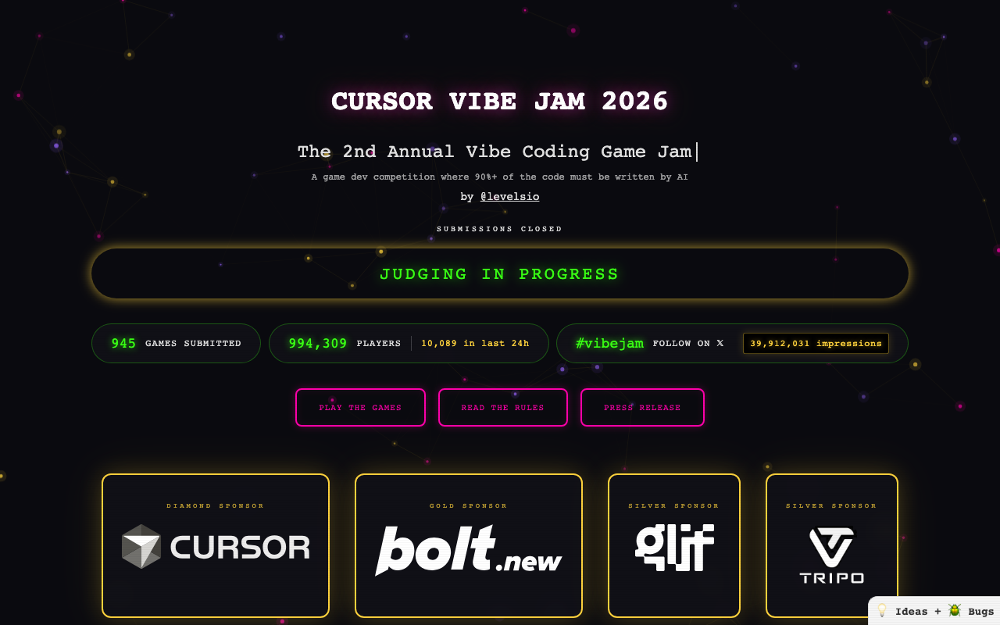

# Pieter Levels (@levelsio) 产品集 · 实地探查

**调研时间**：2026-05-28
**调研方式**：Playwright 实地访问 + WebFetch 文案提取
**截图位置**：`./screenshots/*.png`（桌面 1280×800 + 重点产品 iPhone 14 Pro 移动）

---

## 0. 一个先要破除的幻想：levels.io 没有 portfolio 页

**levels.io 主页就是个博客 listing**——蓝色超链接的标题列表，按时间倒序。最新一篇是 2026-05-26《我朋友 Lisbon 办公室被盗，葡萄牙警察拒绝追回 AirTag 标记的 Apple 显示器》。

没有 "Products" tab、没有产品矩阵展示、没有 MRR 看板（他的 open metrics 主要发在 X 上，不是网站上）。**他从不把自己的网站当"个人品牌主页"经营**——这本身就是个反直觉的观察。他的"品牌"主要靠 X (@levelsio，目前 ~70 万粉丝) + 媒体报道 + Lex Fridman 类播客访谈。

博客内容也很杂：政治评论 / 旅行点评 / 葡萄牙生活吐槽 / 偶尔的产品更新公告。不"营销"，但写得多到可观察的"信号塔"。

---

## 1. PhotoAI · 主力收入产品（$1.65M ARR）

| 桌面 | 移动 |
|---|---|
|  |  |

**Slogan**：🔥 **Fire your photographer**

**核心功能**：上传自拍 → 生成个人 AI 模型 → 任意 pose / place / action 出图 → AI Mocap 视频 / Magic Edit / 批量生成 / Zoom Out / Upscale。"AI Dating Pack"、"Hinge Pack" 等场景化 photo packs。

**社交证明**：
- "29,677,391 张照片已生成" 大字展示在首页
- "#1 AI Photo App" 顶部 banner
- Logo wall：New York Times / TechCrunch / ZDNet / MSN / Marie Claire / Yahoo + 客户 Google / Intel / PwC / Stanford / MIT

**定价**：Pro / Max / Ultra 三档（数字未在首页显示）+ 限时"6 MONTHS FREE"

**视觉设计观察**：
- 移动端**置顶倒计时器** "06:08:55:18 Limited" 制造紧迫感
- 黑色背景 + 紫色 banner + 大量真人 AI 生成照片作为氛围
- CTA 极简："Type your email..." → "Start taking AI photos now" / "Continue with Google"

**给我们的启发**：
1. **场景化 packs** 比"通用 AI 生图工具"卖得动（AI Dating / Hinge 比"修图"更明确）
2. **媒体 logo wall** 极其重要——这是他靠多年 NYT/TechCrunch 报道沉淀下来的资产
3. 单产品做大比矩阵做杂更有效（他自己 2024 年 $420K MRR 巅峰后矩阵下滑，PhotoAI 顶住了基本盘）

---

## 2. Interior AI · 同模板第二款（~$45K MRR）

**Slogan**：🔥 **Fire your interior designer**（注意句式完全和 PhotoAI 对仗）

**核心功能**：拍家里照片 → AI 重新设计 → 55+ 风格（Modern / Scandinavian / Luxury 等） / 虚拟陈列 / Sketch-to-image / SketchUp 渲染 / 3D 飞行视频 / VR walkthrough。

**定价**（透明）：
| 档位 | 月付 | 年付折算 |
|---|---|---|
| Pro | $49/月 | $29/月（多 6 个月） |
| Premium ★ | $99/月 | $49/月 |
| Ultra | $199/月 | $99/月 |

**社交证明**：Netflix / Berkeley / Accenture / Mercedes-Benz；NYT / TechCrunch / Fast Company / Arch Daily

**视觉设计观察**：
- 背景用**马赛克墙**展示 55+ 设计风格缩略图（无限滚动 grid）
- 左侧 5 星 + "#1 AI Interior App" badge
- "Redesign your dream in 5 sec" 入口框

**给我们的启发**：
1. 他**复用了 PhotoAI 的模板** —— 标语 / 定价架构 / Logo wall 都是同一套
2. **"55+ 设计风格"** 比"AI 设计"更有数字感和具体感
3. **年付价腰斩** + "6 个月免费"是他屡试不爽的转化机制

---

## 3. Fly.Pieter.com · 史诗级 vibe-coded 案例（$1M ARR / 17 天）

**第一屏特征**：你打开就在 3D 世界里——蓝天 / 云朵 / 跑道 / 飘着的物体；中间小窗口 "✈️ fly.pieter.com / by @levelsio + Cursor + ThreeJS"。**没有营销 landing page**，直接 "Type your name" → Cloudflare 人机验证 → "Join the game"。

**slogan**：A fun free-to-play MMO flight sim, **100% made with AI**, without loading screens and GBs of updates every time you wanna play 😊

**变现模式**（颠覆传统手游）：
- 免费机型：Cessna 172 / Cyberpink
- 付费机型：F-16 战斗机 **$29.99** 一次性
- **游戏内广告位**："Promote your startup with its own in-game ad and reach 100,000+ people"（按月计费，Stripe 收款）

**关联产品**：
- Live Flight Radar (pieteratc.com)
- Merch 商店
- Vibe Jam（他主办的 game jam）
- Apocalypse Drone（同类衍生）

**给我们的启发**：
1. **"消费品式"的极简首屏** —— 不解释、不营销，直接拉用户进入产品本身
2. **广告位货币化** 比订阅更适合纯娱乐型产品
3. **跨产品互链** —— Fly.Pieter / Vibe Jam / Pieter ATC / Apocalypse Drone 全互相导流
4. **Cloudflare Turnstile 人机验证** 是反白嫖的关键基础设施

---

## 4. Nomads.com（原 NomadList）· 社区会员制

> URL 从 nomadlist.com 重定向到 nomads.com（更短更品牌化）

**slogan**：Go nomad. Join a global community of remote workers living and traveling around the world.

**4 个核心功能**：
- 参加 260 meetups/year，覆盖 100+ 城市
- Meet new people for dating and friends
- Research destinations: 找最适合居住/工作的地方
- Keep track of your travels: 旅行追踪 + 居留日历（税务/签证）

**社区规模**（2026-05）：
- **41,822 members**
- 612 新成员/月
- 15,000+ Telegram 月消息
- 57,704+ meetup attendees（累计）
- 195+ 国家覆盖

**定价**（一次性买断！罕见）：
- Lite Membership $9.99（原价 $19.98，50% off）
- Full Membership $19.99（原价 $39.98，50% off）

**视觉设计观察**：
- 第一屏是**航拍泳池**大图，传达"远程工作者的生活方式"
- 右侧弹出视频自动播放卡片 + email 输入
- 第二屏开始就是密集的城市卡片矩阵 + 各种 filter

**给我们的启发**：
1. **$19.99 一次性买断**是反 SaaS 范式，但对"社区类"产品反而黏性更高（一次付费 = 一直在）
2. **明确数字** ("41,822 members") 比模糊"thousands" 更有说服力
3. 改名 NomadList → Nomads 是一次"去工具化"的品牌升级

---

## 5. RemoteOK · 极简招聘 board（年收入估 $50-70 万）

**slogan**：Remote Jobs in Programming, Design, Sales and more **#OpenSalaries**

**业务量**：
- 100,000+ remote jobs 累计
- 10,000+ top companies 雇主
- 5,700,000+ remote workers 触达
- Premium 4.8/5 from 10K+ reviews

**视觉/产品观察**：
- 极简到极端：搜索 / Location / Salary / Benefits / Sort by 5 个 filter，岗位列表就是核心
- **黄色高亮卡片 = sponsored**（付费置顶岗位）
- 灰色卡片 = 免费 / 自然排序
- 顶部 Banner："Hiring remotely? Reach 5,700,000+ remote workers · Post a remote job"
- 经典 levelsio 标志：emoji + 表情符号当 icon、薪资 tag、"#OpenSalaries" 文化

**雇主侧定价不公开**（首页只放 CTA "Buy a job bundle"），但据公开访谈 $299-499/single job, bundle 折扣

**给我们的启发**：
1. **极简就是产品力** —— 没有花哨的 design，但功能密度足够
2. **OpenSalaries 文化** 把"薪资透明"变成内容生态本身（用户主动贡献）
3. 同样用 emoji + 颜文字做视觉风格化（反 corporate）

---

## 6. HoodMaps · 早期玩闹之作（几乎无收入）

**功能**：用户在地图上给城市的不同区域贴"标签"（搞笑、刻板印象、社区文化），其他用户投票。

**第一屏截图重点解读**（纽约市）：
- 中央河区："Where Pride Started" / "Angry cow" / "Statue of Liberty" / "No subway"
- 西边："Costco is the most happening thing here" / "Black"
- 东边："NPC normies with literally 0 personality" / "French people for some reason" / "Hasidic" / "Maino" / "Mayoricans"
- "Spiderman" / "Lena Dunham" / "Spiderman" 等流行文化标签

**底部 6 个分类**（颜色编码地图）：
- 🤵 Suits / 💰 Rich / 😎 Cool / 📸 Tourists / 🎓 Uni / 🤖 Normies / ⚠️ Crime

**特征**：
- 完全 UGC，levels 自己不产内容
- 现在 levels 已不再积极维护（"$0/mo 历史披露"）
- 但仍上线 8+ 年，证明**"垃圾产品也可以长期挂着"** —— 不删 = 不死

**给我们的启发**：
1. **第一个产品不需要赚钱** —— levels 早期靠 HoodMaps 学到了"地图 + UGC + 病毒分享"的玩法，后来才有 NomadList
2. **运营成本极低的产品可以一直在线**（HoodMaps 是静态地图 + 数据库），有可能哪天就突然火起来
3. 这种"无害但有趣"的产品给个人开发者积累作品集 + X 粉丝 + 试水成本极低

---

## 7. Cursor Vibe Jam 2026 · 第二届 vibe coding 游戏大赛

> URL：jam.pieter.com 重定向到 **vibej.am**

**slogan**：The 2nd Annual Vibe Coding Game Jam · by @levelsio

**当前状态**（截图时点 2026-05-28）：SUBMISSIONS CLOSED / JUDGING IN PROGRESS

**核心数据**（黑底紫绿霓虹）：
- **945 GAMES SUBMITTED**
- **994,309 PLAYERS**（10,089 in last 24h）—— 接近百万人玩过参赛游戏！
- **#vibejam · 39,912,031 IMPRESSIONS** on X —— 近 4000 万曝光

**规则**：
- 游戏必须在 2026-04-01 ~ 2026-05-01 创建
- **90%+ 代码必须由 AI 生成**
- Web-based / 免费 / 无登录 / 无重 loading 屏
- 必须带追踪 widget
- 每人限 1 投稿
- 多人模式优先（非强制）

**奖金**：$40,000（金 $25K / 银 $10K / 铜 $5K）vs 2025 的 $17,500

**赞助商**：
- 💎 Diamond: **Cursor**
- 🥇 Gold: **Bolt.new**
- 🥈 Silver: **Glif**, **Tripo3D**

**视觉设计观察**：
- 纯黑背景 + 紫色霓虹 ASCII 风字体
- 3 个绿色统计卡数据墙
- 3 个紫色 hollow button（PLAY THE GAMES / READ THE RULES / PRESS RELEASE）
- 底部 4 个金色描边的赞助商卡片

**给我们的启发**：
1. **办大赛 = 制造现象 + 拉新流量**：99 万玩家、4000 万 X 曝光都是 levels 个人 IP 的复利
2. Cursor / Bolt 这种工具公司**愿意为 vibe coding 内容付钱**（$40K 奖金 + 推广）
3. levels 自己**不参赛**只主办——把流量沉淀到自己的 ecosystem（fly.pieter / pieter.com / @levelsio）

---

## 八、跨产品规律观察（10 条）

1. **"Fire your X"** 是他的标语模板（PhotoAI、InteriorAI 都用）—— 对标"AI 替代某个高客单职业"
2. **🔥 + emoji slogan** 是视觉锚点
3. **6 MONTHS FREE / 年付腰斩** 是反复用的转化机制
4. **Logo wall 永远在首页**（NYT / TechCrunch / 客户企业 logo）
5. **数字必须巨大且具体**（29,677,391 / 5,700,000+ / 41,822 / 994,309）
6. **CTA 用动词不用名词**："Start taking AI photos" / "Join the game" / "Go nomad"
7. **首页就是产品**（Fly / RemoteOK）或**首屏就要邮箱**（PhotoAI / InteriorAI / Nomads）
8. **emoji 当 icon 用**（5/7 个产品都是 emoji 而非自定义 icon）
9. **跨产品互链**（Fly 链 Vibe Jam 链 Pieter.com；NomadList 链 RemoteOK）
10. **levels.io 主域名故意"不商业化"** —— 博客而非 portfolio，让人觉得"这人不卖东西"反而拉好感

## 九、我们 5 个 MVP 跟 levels 的对照（哪些已有 / 哪些缺）

| levels 套路 | 我们 5 个 MVP 现状 |
|---|---|
| "Fire your X" slogan 模板 | ❌ 我们的标题都偏功能描述（"诗经起名" / "倒数日 Pro" / "AI 植物医生"）—— 缺替代 + 情绪冲击 |
| 数字社交证明 | ❌ 完全没有（MVP 没用户）。**上线 1 周后必须挂出来** |
| Logo wall | ❌ 没有；初期可以挂"Featured on Indie Hackers / Product Hunt" |
| 6 个月免费 / 限时倒计时 | ❌ 完全没用（付费墙是 mock，没启用紧迫感）|
| 跨产品互链 | ⚠️ 部分（mvp/README 链接 5 个产品；但产品之间无内部互链）|
| Cloudflare Turnstile 防 abuse | ❌ 没接（mock 阶段不需要，但真 ship 必须）|
| **首页即产品**（不解释直接交互）| ✅ 02 倒数日列表页接近这个范式 / ❌ 其他 4 个都有 hero+营销文案 |
| 大量真实截图 / 用户生成内容做氛围 | ⚠️ 占位图，需要 codex 生成 |
| 用 emoji 当 icon | ✅ 我们也用了大量 emoji，对齐了 |

## 十、我建议优先抄的 3 条 levels 经验

1. **改标语为"Fire your X"系**：
   - PhotoAI 模仿 → 01 起名："**Fire your fortune teller**" / "**Fire your old auntie 给宝宝起名 better than your mom-in-law**"（暴力但抓眼球）
   - InteriorAI 模仿 → 03 植物医生："**Fire your flower shop owner**"（避开"医生"避免医疗合规争议）
   - 当然这是英文标语，中文需要本地化（"再也不用问妈妈给宝宝起名"之类）
2. **首页右上角永远展示一个数字**：
   - 01 起名："已生成 1,234 个名字 · 通过 verify_quote 校验"
   - 02 倒数日："正在惦记 X 件事"（已经有了，但可以放更显眼）
   - 03 植物医生："已救活 X 盆植物"
   - 04 梦境日记："已记录 X 个梦境"
   - 05 宠物心情卡片："已生成 X 张卡片 · 分享 X 次"
3. **抄他的极简首屏，去掉过度营销文案**：
   - levels 的产品几乎没有"Why us / How it works / Features" 这种解释段
   - 第一屏要么直接是产品（Fly / RemoteOK），要么是"先放邮箱"（PhotoAI），中间不浪费用户 3 秒注意力

---

**完整截图位置**：`/Users/bytedance/Documents/research/levelsio-products/screenshots/`

| 产品 | 桌面 | 移动 |
|---|---|---|
| levels.io | ✓ levels-io-desktop.png | – |
| PhotoAI | ✓ photoai-desktop.png | ✓ photoai-mobile.png |
| InteriorAI | ✓ interiorai-desktop.png | – |
| Fly.Pieter.com | ✓ fly-pieter-desktop.png | (mobile 截图失败) |
| Nomads.com | ✓ nomadlist-desktop.png | – |
| RemoteOK | ✓ remoteok-desktop.png | – |
| HoodMaps | ✓ hoodmaps-desktop.png | – |
| Vibe Jam 2026 | ✓ jam-pieter-desktop.png | – |
