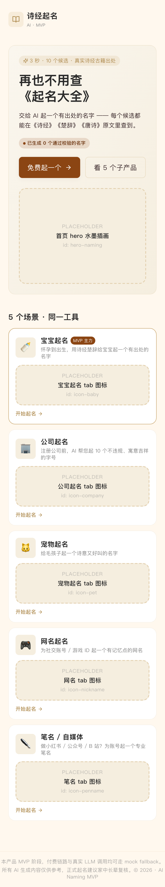
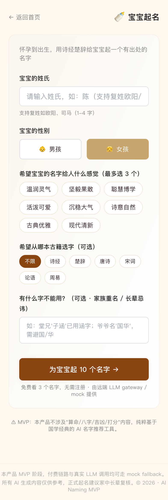
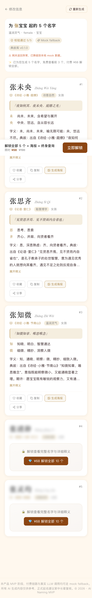
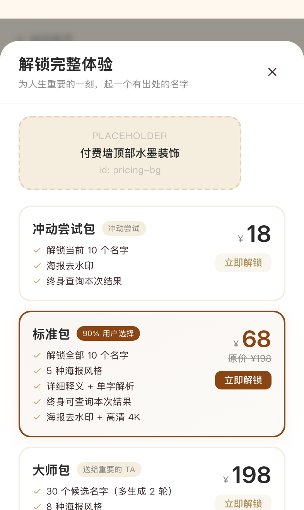

# 01 - AI 起名 (MVP)

> Next.js 14 App Router + TypeScript + Tailwind CSS。5 子产品 tab（宝宝起名 + 公司 / 笔名 / 宠物 / 网名）共用一套脚手架，宝宝起名最完整。

## 📱 手机端截图（iPhone 14 Pro · 393×852）

| 首页 | 宝宝起名表单 |
|---|---|
|  |  |
| 情绪化主标「再也不用查《起名大全》」(levels Fire-your-X 范式中文翻译) · 右上角数字 banner「已生成 N 个通过 verify_quote 校验的名字」(N 为本地真实累计，新用户显示 0；不伪造社交证明) · 删除"3 步流程"和"数据库公开度"扩展段 · 保留 5 子产品卡片网格（导航必要） | 姓氏 / 性别 / 意境表单（30s 完成）|

| 起名结果 | 付费墙（Mock） |
|---|---|
|  |  |
| 10 张名字卡片 · 真实诗经/楚辞出处 · `verified=false` 橙色警告 | ¥18 / ¥68 / ¥198 三档 · mock 二维码占位 |

> 真机访问：`PORT=3001 npm run dev`，手机连同 Wi-Fi 后开 `http://<电脑IP>:3001`。

## 本地运行

```bash
cd mvp/products/01-ai-naming
npm install
npm run dev
# 浏览器访问 http://localhost:3000
```

走完整流程：
1. 首页选 "宝宝起名" → 进入 `/baby`
2. 填表（姓氏 + 性别 + 意境标签）→ 点 "为宝宝起 10 个名字 →"
3. 结果页 `/baby/result` 显示 10 张名字卡，前 3 张免费完整可见，后 7 张模糊带付费遮罩
4. 点任一卡的 "生成海报" → 弹出 PosterPreview，3 种风格切换 + 下载 PNG
5. 点 "立即解锁" → 弹出付费墙（3 档：¥18 / ¥68 / ¥198）→ 点任一档弹出 mock 支付二维码

## 环境变量（可选，全部不填走 mock）

```bash
cp .env.example .env.local
# 编辑 .env.local，至少填一个 LLM key（优先级 DeepSeek > 智谱 > OpenAI）
DEEPSEEK_API_KEY=sk-xxx
# 或：
ZHIPU_API_KEY=xxx
# 或：
OPENAI_API_KEY=sk-xxx
```

- 不填任何 key：API 走 mock fallback，返回 5 个真实诗经/楚辞名字（陈未央 / 陈思齐 / 陈知微 / 陈清辞 / 陈灵均 等）。
- LLM 调用失败时也自动降级到 mock，不会让用户看到 500。

## 关键实现

### 典故白名单（MVP 硬门槛）

- 数据库：`lib/classics-db.json`（诗经 32 篇 + 唐诗 22 首 + 楚辞 5 篇 + 论语 5 章 + 宋词 7 首，覆盖 71 篇共 ~270 条原文）
- 校验函数：`lib/verifyQuote.ts` 三级匹配（精确 book+chapter > 仅 book > 全库模糊）
- 每个 LLM 返回的名字都会被 `verifyQuote()` 校验；失败的标记 `verified: false`
- 结果页对 `verified: false` 的名字显示 **橙色警告 "出处待人工核验"**

### LLM 集成

- `lib/llm.ts`：统一 proxy，OpenAI-compatible 协议（DeepSeek / 智谱 GLM / OpenAI 都走同一函数）
- 默认 model：`deepseek-chat`（成本 ¥0.05/次 vs GPT-4o ¥0.3/次）
- 超时 25s + 重试 1 次 + 全部失败 → mock fallback
- Prompt：`lib/prompts/baby-naming.ts`（800+ 字 System Prompt，来自 detail-01 § A.1.1 + A.1.4）

### 黑名单 / 字符过滤

- 19 字硬黑名单（梓涵 / 紫萱 / 子轩 等）：直接剔除
- 13 字软黑名单（梓 / 萱 / 涵 / 轩 / 宸 等）：所有名字中含此类的不超过 1 个
- 不吉字 + 过大字：硬过滤

### 海报生成

- 客户端 `html2canvas` 把 React 组件转 PNG，scale=2 输出高清
- 3 种内置风格：中国水墨 / 古典宣纸 / 现代简约
- 校验未通过的名字 **不允许生成海报**（按钮禁用 + tooltip 提示）

### 付费墙

- 3 档 SKU：¥18 / ¥68 / ¥198，¥68 高亮 "90% 用户选择"
- 点击任一档弹出 mock 二维码 + "联系客服微信" 文案，**不接真实支付**

## 已知限制

- MVP 阶段：付费链路是 mock，未接 Apple IAP / 微信支付
- 典故库：当前为最小子集（71 篇），上线前需扩充至 305 + 300 + 楚辞核心全集
- 数据持久化：仅 URL params + 内存（结果页刷新会重新调 API）
- LLM 调用：默认 mock；配 key 后走真实 API
- 占位图：4 类共 8 张图待 codex 生成，见 `codex-todo-illustrations.md`
- 拼音库：mock 名字内置常见姓拼音映射；真实生产应接 `pinyin-pro` 等库
- 字符集白名单（《通用规范汉字表》一二级）：当前依赖 Prompt 约束 + 黑名单，未做完整字典校验

## 验证清单（subagent 自检）

- [x] 文件结构按 SHARED-CONVENTIONS.md
- [x] App Router（无 Pages Router）
- [x] TypeScript strict + noUncheckedIndexedAccess
- [x] 5 子产品 tab（baby/company/pet/nickname/penname）
- [x] 完整 Prompt v1 (`lib/prompts/baby-naming.ts`)
- [x] 典故白名单 `lib/classics-db.json` + `verifyQuote()`
- [x] LLM proxy + mock fallback
- [x] 海报生成 (html2canvas + 3 风格)
- [x] 付费墙 mock（¥18/¥68/¥198）
- [x] Placeholder 组件 + codex-todo-illustrations.md
- [ ] 真实 LLM key 路径（如有 key 可手测；CI 跑不通）

## 部署

```bash
npm run build
# 输出 .next/standalone 可直接 vercel deploy 或 docker build
```

## 合规

参考 `/Users/bytedance/Documents/research/light-products/compliance-checklist.md` § 1️⃣ AI 起名：

- 已禁用"五行/八字/吉凶/打分"命理词
- 已实现 19 字硬黑名单 + 13 字软黑名单
- 已实现典故白名单 verify_quote()
- 海报模板含 "诗经起名 · AI" 水印（合规要求 AI 显著标识）
- 未实现：日志留存 6 个月（MVP 阶段）/ 字符集一二级白名单完整字典


---

## iOS / Android 原生壳（Capacitor）

```bash
# 同步 web 资产到原生工程
npm run build
npx cap sync

# 打开 Xcode 工程（需 macOS + Xcode + CocoaPods）
npx cap open ios

# 打开 Android Studio 工程（需 Android Studio + JDK 17 + SDK）
npx cap open android
```

`ios/` 和 `android/` 目录由 `npx cap add ios && npx cap add android` 生成，已入 git；不入 git 的是 `ios/App/Pods/`、`android/build/` 等构建产物（见 .gitignore）。

## OTA 热更新（@capgo/capacitor-updater）

发布新版本 web bundle（不重新提审 App Store）：

```bash
# 1. 提升 version
npm version patch    # 0.0.1 → 0.0.2

# 2. 构建 + 发布到 ota-backend
npm run build
../../scripts/publish-bundle.sh 01-ai-naming $(node -p "require('./package.json').version") dist
```

客户端 (`src/mobileUpdates.ts`) 启动后 2.5s 自动检查更新，下载新 bundle，下次冷启动应用。

需要：
- Cloudflare R2 bucket + KV namespace（mvp/ota-backend 部署后获得）
- `OTA_ADMIN_TOKEN` 环境变量
- 客户端 .env 配置 `VITE_OTA_BACKEND_URL`

详细发布流程见 [`mvp/ota-backend/README.md`](../../../ota-backend/README.md)。
