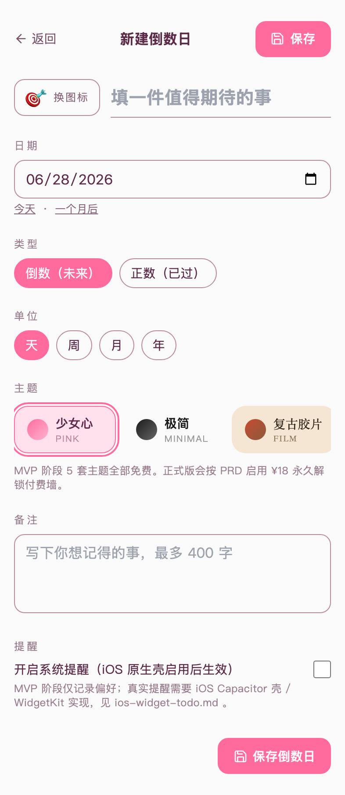
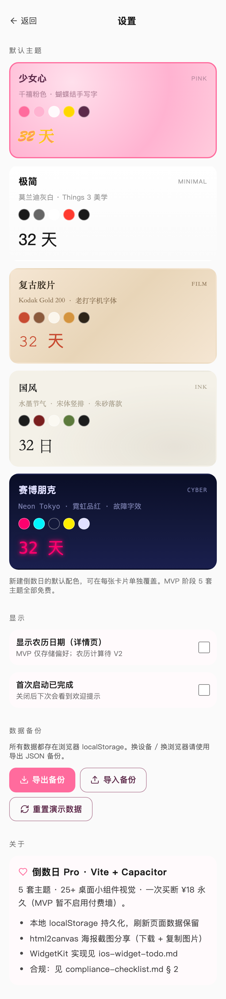

# 02 - 倒数日 Pro (Vite + Capacitor + OTA)

> 把重要的日子挂在桌面上。5 套主题 · 25+ 桌面小组件视觉 · 海报截图分享。
>
> 5 个 MVP 中的**先驱者**：Vite + React Router 6 + Capacitor 6 + `@capgo/capacitor-updater` OTA。
> **iOS 桌面 / 锁屏小组件实现详见 [`ios-widget-todo.md`](./ios-widget-todo.md)**。

## 技术栈

| 层 | 选型 |
|---|---|
| 打包 | Vite 5（端口 3002） |
| 框架 | React 18.3 + React Router 6 |
| 状态 | zustand 4.x + localStorage（zod 校验） |
| 样式 | Tailwind 3.4 + 5 套主题 CSS variables |
| 移动 | Capacitor 6（iOS / Android） |
| OTA | `@capgo/capacitor-updater` 6.x，远端走 `mvp-ota.workers.dev` |
| 测试 | Vitest + jsdom |

`appId`: `io.countdownpro.app`（Capacitor 不支持 Java package 中的连字符，已从 design 的 `io.countdown-pro.app` 去横线；详见 root design.md "Open Questions" 第 8 条更新）。

## 📱 手机端截图（iPhone 14 Pro · 393×852）

| 列表（含种子数据） | 列表（空态） |
|---|---|
|  |  |
| Levels 范式：上标「FIRE YOUR REMINDER APP」+ 主标「比 iOS 提醒事项美 10 倍」· 大字号实时计数「3 件正在惦记的事」+「累计创建 N」徽章 (N 为本地真实计数，新用户显示 0) · 3 套主题同列 | 同 hero 样式 · "新建 / 设置" 双 CTA |

| 新建 | 设置（5 主题切换 + 备份） |
|---|---|
|  |  |
| emoji 选择器 + 日期 + 主题 + 单位 + 备注 + 提醒 mock | 全主题 gallery · JSON 导入导出 · 演示数据重置 |

> 真机访问：`npm run dev`，手机连同 Wi-Fi 后开 `http://<电脑IP>:3002`。

## 本地运行

```bash
cd mvp/products/02-countdown
npm install
npm run dev          # 浏览器访问 http://localhost:3002
npm run build        # 产 dist/index.html
npm run preview      # 预览生产构建
npm test             # vitest（24 case）
npm run type-check   # tsc --noEmit
```

## Capacitor / 原生工程

```bash
# 首次（已执行；ios/ android/ 入 git）
npx cap add ios
npx cap add android

# 每次改前端：build + 同步到原生工程
npm run cap:sync

# 打开 Xcode / Android Studio
npm run cap:ios
npm run cap:android
```

注意：CocoaPods 与 Android SDK 不在 git 仓库内安装；首次开 Xcode 前需 `sudo gem install cocoapods && cd ios/App && pod install`。Android 需在 Android Studio 内 import gradle。

## OTA 发布

```bash
# 1. 改前端 → npm run build
# 2. 设置环境变量（一次）
export OTA_ADMIN_TOKEN="<token from wrangler secret>"

# 3. 发版
npm run ota:publish
# 内部会：
#   - zip dist/ → /tmp/02-countdown-<version>.zip
#   - 上传到 R2: mvp-ota-bundles/io.countdownpro.app/<version>.zip
#   - POST /admin/manifest 到 mvp-ota.workers.dev
# 客户端 2 分钟内自动检测 → 下载 → set bundle
```

`scripts/publish-bundle.sh` 见 `mvp/shared-mobile-template/scripts/`（T11 集成时落地软链/拷贝）。

## 路径一览（React Router 6）

| 路径 | Component | 备注 |
|---|---|---|
| `/` | `routes/ListPage.tsx` | 卡片网格 + 浮动 + 按钮 |
| `/new` | `routes/NewPage.tsx` | 新建表单 |
| `/:id` | `routes/DetailPage.tsx` | 详情 + Widget 预览 + 海报分享 |
| `/:id/edit` | `routes/EditPage.tsx` | 编辑（复用 CountdownForm） |
| `/settings` | `routes/SettingsPage.tsx` | 默认主题 / 备份导入导出 / 关于 |

## 5 套主题

| ID | 名字 | 主色 | 适用场景 |
|---|---|---|---|
| `pink` | 少女心 | `#FF6B9D` 玫瑰粉 | 千禧粉色 / 蝴蝶结 / 手写体 |
| `minimal` | 极简 | `#1A1A1A` 墨黑 | 莫兰迪灰白 / Things 3 美学 |
| `film` | 复古胶片 | `#C84B31` 褪色朱红 | Kodak Gold 200 / 颗粒 / 打字机 |
| `ink` | 国风 | `#1C1C1C` 松烟 + `#7A1F1F` 朱砂 | 水墨节气 / 宋体竖排 / 落款 |
| `cyber` | 赛博朋克 | `#FF006E` 霓虹品红 | Neon Tokyo / 故障字效 / 网格 |

主题数据定义在 [`src/lib/themes.ts`](./src/lib/themes.ts)，CSS 装饰类（grain / scanlines / film-perforations / pink-paper / ink-paper）定义在 [`src/styles.css`](./src/styles.css)。

## 关键模块

| 模块 | 文件 |
|---|---|
| 主题数据 + CSS variables | `src/lib/themes.ts` |
| 倒数日 CRUD store (zustand) | `src/lib/store.ts` |
| localStorage 持久化 + 导入导出 | `src/lib/storage.ts` |
| 日期计算 (date-fns) | `src/lib/dateMath.ts` |
| 海报截图 (html2canvas) | `src/lib/exportPoster.ts` |
| Widget 三尺寸预览 | `src/components/WidgetPreview.tsx` |
| 详情页海报组件 | `src/components/SharePoster.tsx` |
| 5 主题装饰 SVG (蝴蝶结/印章/霓虹角) | `src/components/ThemeDecorations.tsx` |
| OTA 客户端（notifyAppReady / check / download / set） | `src/mobileUpdates.ts` |

## 环境变量

`.env`：

```ini
VITE_PRODUCT_INDEX=2                                # → vite dev port 3002
VITE_APP_ID=io.countdownpro.app                     # Capacitor + OTA
VITE_OTA_BACKEND_URL=https://mvp-ota.workers.dev    # T5 OTA backend
VITE_GATEWAY_URL=https://mvp-gateway.workers.dev    # T4 gateway (02 不用)
```

倒数日 02 全本地，**不调任何 LLM**。`VITE_GATEWAY_URL` 仅为 5 产品模板一致性保留。

## 数据模型

```ts
interface Countdown {
  id: string;
  title: string;
  targetDate: string;       // ISO yyyy-MM-dd
  type: 'countdown' | 'countup';
  emoji: string;
  theme: 'pink' | 'minimal' | 'film' | 'ink' | 'cyber';
  note: string;
  createdAt: string;
  updatedAt: string;
  unit: 'day' | 'week' | 'month' | 'year';
  notify: boolean;
}
```

存储格式（localStorage key `countdown-pro:cards`）：

```json
{
  "version": 1,
  "cards": [ { "id": "demo-1", "title": "考研倒计时", "...": "..." } ]
}
```

首次启动若 localStorage 为空，会自动 seed 3 张演示卡（考研 / 婚礼 / 正数纪念）。

## 测试

```bash
npm test           # 一次性
npm run test:watch # watch 模式
```

覆盖：
- `src/lib/storage.test.ts` — 13 case（CRUD + zod 拒收 malformed payload + import/export round-trip）
- `src/lib/dateMath.test.ts` — 11 case（countdown / countup / unit divisor / statusLabel 全 path）

测试用 `src/test-setup.ts` 注入了一个 in-memory localStorage polyfill，绕过 Node 25 内置 `localStorage` 缺 `.clear()` 的 bug。

## 已知限制

- MVP 阶段：**付费墙未启用**，5 套主题全部免费。正式版会按 PRD ¥18 永久解锁。
- LLM 调用：**不需要**，此产品全本地。
- iCloud / 飞书日历同步：未实现，留 V2。
- 真实系统通知 / 桌面小组件：必须等 iOS Capacitor 壳 + WidgetKit Extension，见 `ios-widget-todo.md`。
- 数据持久化：仅 localStorage，刷新浏览器数据保留，换设备 / 换浏览器不同步。
- 占位图：见 [`codex-todo-illustrations.md`](./codex-todo-illustrations.md)。
- `html2canvas` 在 Capacitor WKWebView 兼容性：**未实测**。T11 集成阶段需在模拟器内验证；如失败可降级到 `@capacitor/screenshot` 截屏。

## 部署

Web 部署仅作为 OTA bundle 的源头；终端用户走 iOS App Store / Android Play Store。
Web 也可独立部署到 Cloudflare Pages / Vercel：

```bash
npm run build
# dist/ 直接 deploy
```

## 合规

详见 [`compliance-checklist.md § 2`](../../../light-products/compliance-checklist.md)。
本产品**无显著法律雷点**，是 5 个 MVP 里最干净的 idea。

## iOS Widget 接力

请在原生 iOS 工程接力时直接读 [`ios-widget-todo.md`](./ios-widget-todo.md)，里面有：
- 5 个 WidgetKit 尺寸的实现优先级与 Swift 骨架
- App Group / UserDefaults 同步 contract
- Timeline 刷新策略（每天 1 次，含 24-entry buffer）
- 锁屏 accessoryCircular / accessoryRectangular 单色适配
- 5 套主题色 hex 与 web 端 1:1 对齐

## 验证 Checklist (T6 实施)

- [x] 删除 Next.js (app/ next.config.mjs next-env.d.ts .next)
- [x] 迁移 lib/ components/ → src/lib/ src/components/（去 'use client'，next/* → react-router-dom）
- [x] 5 个路由全部建立（src/routes/*.tsx）
- [x] Vite 入口三件套（index.html / vite.config.ts / src/main.tsx）
- [x] capacitor.config.ts（appId io.countdownpro.app）
- [x] src/mobileUpdates.ts 从 ai-baby 移植 + 4 处改写
- [x] tsconfig.json 切到 Bundler / react-jsx / @/ 别名
- [x] tailwind content glob 切到 src/**
- [x] postcss.config.js 改 ESM
- [x] npm install 通过
- [x] npm run type-check 0 error
- [x] npm run build 产 dist/index.html
- [x] npm test 24 case 全过（含 jsdom + Node 25 localStorage polyfill）
- [x] npx cap add ios → ios/App/ 生成
- [x] npx cap add android → android/app/ 生成
- [x] npx cap sync 无错
