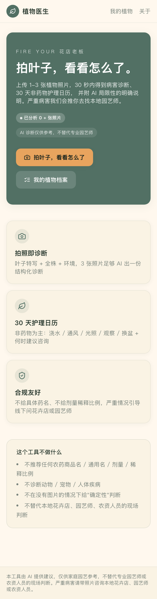
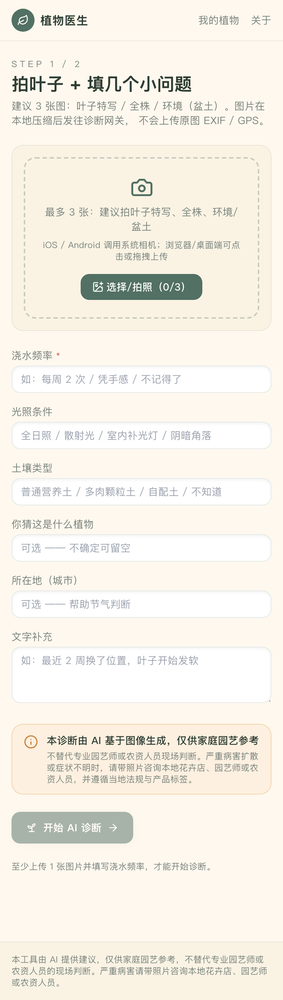
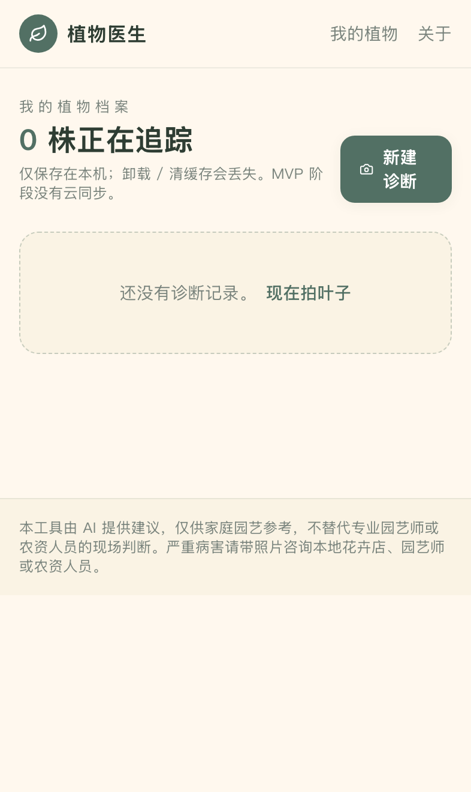
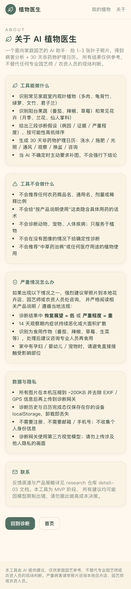

# 03 - AI 植物医生 (MVP)

> 拍叶子，30 秒诊断病害 + 30 天个性化护理日历。
> codex review 加固版：**禁止任何农药商品名 / 通用名 / 剂量 / 稀释比例**。

## 📱 手机端截图（iPhone 14 Pro · 393×852）

| 首页 | 拍照上传 |
|---|---|
|  |  |
| 情绪化主标「Fire your 花店老板」(避开"医生"医疗暗示) + 副标「会看叶子的 AI 园丁」· 右上角数字 banner「已分析 N 株植物」(N 为本地真实累计，新用户显示 0)· 删除三步走说明段 · 能诊断范围压成 1 行 emoji 标签 · 保留「我们不开药方」合规护栏 | 多图上传（特写/全株/环境）· 客户端压缩 |

| 我的植物 | 关于 + 完整 Disclaimer |
|---|---|
|  |  |
| 历史诊断列表 · localStorage 持久化 | 显式说明"非药物建议"边界 · 食用作物特别提示 |

> 真机访问：`PORT=3003 npm run dev`，手机连同 Wi-Fi 后开 `http://<电脑IP>:3003`。

## 本地运行

```bash
npm install
npm run dev
# 浏览器访问 http://localhost:3000
```

## 环境变量（可选，全部不填走 mock）

```bash
cp .env.example .env.local
# 编辑 .env.local，至少填一个 key 即可走真实 LLM
#   ZHIPU_API_KEY=...       # 主调（推荐：国内直连 + 中文好）
#   OPENAI_API_KEY=...      # 备调
```

无 key 时，`/api/diagnose` 会返回多肉黑腐 mock 数据，全链路依然可演示。

## 单元测试 —— lintAction

```bash
npm test
```

lintAction 是合规双重保险：扫描 LLM 输出文本，命中任何农药名 / 稀释比例 / 频次时，整段替换为 `请咨询本地园艺师或农资人员`。测试用例包含：

- 喂故意带 `70% 多菌灵 1:1000` 的 mock 输出 → 被替换
- 单独 `波尔多液`、`绿亨一号` → 被替换
- 稀释比例 `1:1000` / 浓度 `5ml/L` / 频次 `喷洒 3 次` → 被替换
- 民间偏方 `小苏打溶液` → 被替换
- 普通文案 `颗粒土比例 70% 以上` → 不误伤

## 类型检查 / 构建

```bash
npm run type-check
npm run build
```

## 关键文件

- `app/api/diagnose/route.ts` —— POST 接口，调 LLM + 调用 lintAction + 返回 mock 兜底
- `lib/prompt.ts` —— **完整复制 detail-03 § A.1.1 codex 修订版 System Prompt**
- `lib/llm.ts` —— 智谱 GLM-4V → OpenAI GPT-4V → mock 的降级链
- `lib/lintAction.ts` —— 双重保险合规过滤器（含黑名单 + 剂量正则）
- `lib/lintAction.test.ts` —— 单元测试
- `lib/schema.ts` —— zod schema：`likelihood: '高/中/低'`、`recovery_outlook: '高/中/低'`，**无百分比字段**
- `lib/diseases-db.json` —— 25 个高频病害知识库（来自 detail-03 § B）
- `lib/mockDiagnosis.ts` —— mock 数据（多肉黑腐完整示例）
- `components/ImageCapture.tsx` —— 拍照/上传（移动端调相机、桌面拖拽、客户端压缩 200KB）
- `components/CareCalendar.tsx` —— 7×5 网格 30 天护理日历，含勾选打卡
- `components/DisclaimerBanner.tsx` —— 强制嵌入的 AI 标识 + 食用作物额外提示

## 已知限制（MVP）

- **付费墙**：未接真实支付，所有功能本地体验
- **LLM 调用**：默认 mock，配 ZHIPU/OpenAI key 后走真实视觉模型
- **数据持久化**：仅 localStorage，刷新保留，换设备 / 换浏览器不同步
- **占位图**：见 `codex-todo-illustrations.md`

## 合规承诺（codex review 加固）

参考 `light-products/compliance-checklist.md § 3️⃣`。

- 绝对不输出任何农药商品名 / 通用名 / 剂量 / 稀释比例
- `likelihood` / `recovery_outlook` 使用「高/中/低」，**不使用百分比**
- AI 自定位「AI 助手」，不伪装真人专家（"15 年植物病理学家"等措辞禁用）
- 每次结果页头部强制 banner：「本诊断由 AI 基于图像生成，仅供家庭园艺参考」
- 食用作物（番茄/草莓/辣椒等）页面额外提示「食用前请咨询专业人员」
- 双重保险：LLM 返回后 lintAction 再次扫描，命中即替换为安全话术

## 部署

```bash
npm run build
vercel deploy
# 国内合规建议：使用智谱直连，OpenAI 在国内备案受限
```


---

## iOS / Android 原生壳（Capacitor）

```bash
# 同步 web 资产到原生工程
npm run build
npx cap sync

# 打开 Xcode 工程（需 macOS + Xcode + CocoaPods）
npx cap open ios

# 打开 Android Studio 工程（需 Android Studio + JDK 17 + SDK）
npx cap open android
```

`ios/` 和 `android/` 目录由 `npx cap add ios && npx cap add android` 生成，已入 git；不入 git 的是 `ios/App/Pods/`、`android/build/` 等构建产物（见 .gitignore）。

## OTA 热更新（@capgo/capacitor-updater）

发布新版本 web bundle（不重新提审 App Store）：

```bash
# 1. 提升 version
npm version patch    # 0.0.1 → 0.0.2

# 2. 构建 + 发布到 ota-backend
npm run build
../../scripts/publish-bundle.sh 03-plant-doctor $(node -p "require('./package.json').version") dist
```

客户端 (`src/mobileUpdates.ts`) 启动后 2.5s 自动检查更新，下载新 bundle，下次冷启动应用。

需要：
- Cloudflare R2 bucket + KV namespace（mvp/ota-backend 部署后获得）
- `OTA_ADMIN_TOKEN` 环境变量
- 客户端 .env 配置 `VITE_OTA_BACKEND_URL`

详细发布流程见 [`mvp/ota-backend/README.md`](../../../ota-backend/README.md)。
