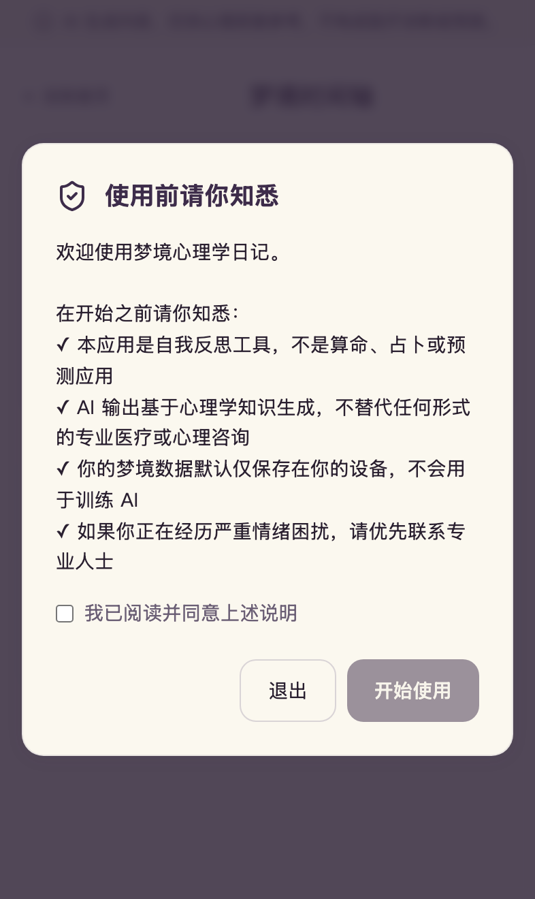
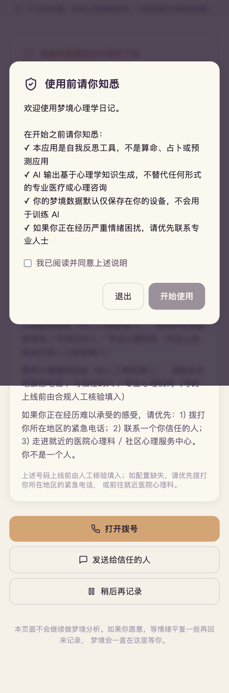
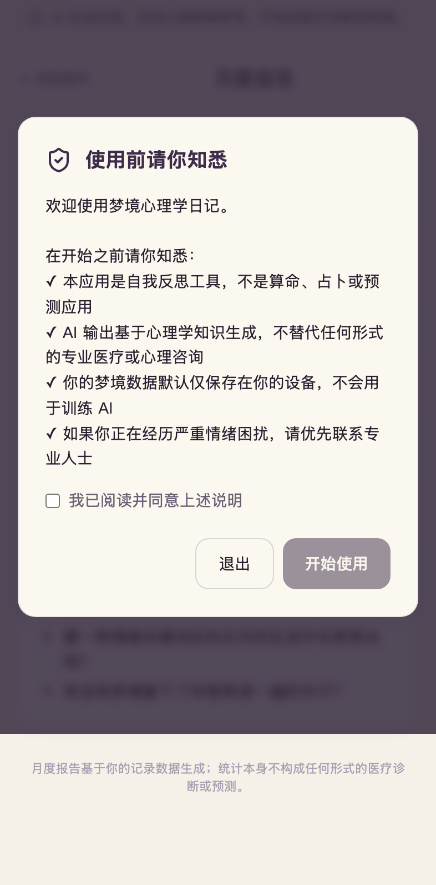
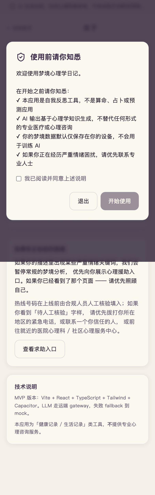

# 04 - 梦境心理学日记 (MVP)

> 心理反思工具。**不是**算命、占卜、运势或预测应用。

## 📱 手机端截图（iPhone 14 Pro · 393×852）

| 首页 | 时间轴 |
|---|---|
|  |  |
| 主标「让心理学帮你看见自己」+ 口语化副标「今晚做了什么梦？」· 右上角数字 banner「已记录 N 个梦境」(N 为本地真实累计，新用户显示 0；合规：娱乐产品禁用 Fire your X 模板，避免暗示替代专业咨询) · DreamInput 大输入框 + 语音 · 顶部 disclaimer 条 + footer 免责声明保留（截图脚本预 seed ack 跳过 FirstLaunchGate 弹窗以展示 hero） | localStorage 梦境历史 · 月份分组 |

| ⚠️ 危机页（合规核心） | 月度报告 |
|---|---|
|  |  |
| 暖橙关怀页 · 3 按钮：「打开拨号」「发送给信任的人」「稍后再记录」 · **无"继续分析"按钮** ✅ | 月度梦境主题统计 + 情绪曲线（mock） |

| 关于 + Disclaimer |
|---|
|  |
| 显式说明心理学日记定位 · 多视角参考 · AI 生成标识 |

> ⚠️ 截至当前，热线号码全部为 `{{placeholder}}`，上线前必须人工核验。
> 真机访问：`PORT=3004 npm run dev`，手机连同 Wi-Fi 后开 `http://<电脑IP>:3004`。

## 本地运行

```bash
cd mvp/products/04-dream-journal
npm install
npm run dev
# 浏览器访问 http://localhost:3000
```

## 环境变量（可选，全部不填走 mock fallback）

```bash
cp .env.example .env.local
# 编辑 .env.local 任意填一个：
# DEEPSEEK_API_KEY=
# ZHIPU_API_KEY=
# OPENAI_API_KEY=
```

未配置任何 key 时：API route 自动走 `lib/mockAnalysis.ts` 的完整结构化示例（含弗洛伊德 / 荣格 / 格式塔三视角），demo 完全可跑通。

## 已实现功能

- 文字 / 浏览器原生语音输入（Web Speech API，仅 Chrome / Edge 等支持）
- AI 梦境分析（三流派视角 + 反思问题 + 情绪标签）
- **严重情绪三级关键词检测**（一级强制跳转 `/crisis`，不调 LLM）
- 危机干预页面 `/crisis`（**无"继续分析"按钮**）
- 35 个高频意象的多流派解读（`lib/symbols-db.json`）
- 时间轴 / 月度报告 / 首次启动强制弹窗
- 客户端强制 disclaimer 注入（不依赖 LLM 自觉）
- 合规 lint（`npm run compliance-lint`）

## 测试

```bash
# 三级危机检测回归测试（17 个 case）
node --test --import tsx lib/detectCrisis.test.ts

# 合规 lint（禁词 + 硬编码热线号码）
npm run compliance-lint

# TypeScript 类型检查
npm run type-check

# 生产构建
npm run build
```

### 手动验证用例

| 输入 | 期望结果 |
|---|---|
| `我梦到自己跳楼` | 客户端直接跳转 `/crisis`，**不**调用 LLM API |
| `我不想活了` | 服务端 API 返回 `redirectToCrisis: true`，客户端跳转 `/crisis` |
| `梦到自己很绝望` | 常规分析 + 末尾追加暖色卡片（二级触发） |
| `梦里我好孤独` | 常规分析 + 末尾追加温和建议（三级触发） |
| `梦到自己在海边飞翔` | 普通分析流程，无 crisis 标记 |

## 严重情绪三级检测系统

**位置**：`lib/crisisKeywords.ts` + `lib/detectCrisis.ts`

| 级别 | 关键词样例 | 处理 |
|---|---|---|
| 一级 | 自杀 / 跳楼 / 想死 / 自残 / 消失算了 | 客户端 + 服务端双重拦截，强制跳转 `/crisis`，**不调 LLM** |
| 二级 | 绝望 / 撑不住 / 崩溃 / 破防 | 常规分析 + 末尾暖色卡片 + 热线占位符 |
| 三级 | 孤独 / 想消失 / emo / 摆烂 | 常规分析 + 末尾温和咨询建议 |

**关键词清单每月人工复核一次**（含网络新词如 emo / 破防）。

## ⚠️ 上线前必做（codex review 强制）

### 心理援助热线核验

**MVP 阶段所有热线号码均为 placeholder（`{{crisis_hotline_primary}}` 等），代码 / Prompt / 文案中没有任何硬编码的真实号码。**

上线前必须完成以下步骤：

1. **人工逐条核验** `lib/crisisHotlines.ts` 中的每条热线记录：
   - 拨打测试号码是否可接通
   - 服务地区 / 服务时间是否准确
   - 来源 URL 是否仍然指向官方权威页（卫健委 / 三甲医院心理科 / IASP 等）
2. 填入字段：`number` / `lastVerified` / `verifiedBy`
3. **每月 1 号复核全部热线**（设置 calendar reminder）
4. 任何复核未通过的热线立即从配置中移除
5. **配置缺失时显示通用 fallback 文案**（`GENERIC_CARE_FALLBACK`），**绝不编造号码**

### 合规清单

参考 [`../../../light-products/compliance-checklist.md`](../../../light-products/compliance-checklist.md) § 4️⃣ 梦境日记。

- [ ] `npm run compliance-lint` 通过（禁词 + 硬编码热线检测）
- [ ] `node --test --import tsx lib/detectCrisis.test.ts` 全绿
- [ ] 一级触发测试：输入"我梦到自己跳楼"应直接跳 `/crisis`，**确认无"继续分析"按钮**
- [ ] App 介绍页 / 截图文案 / 应用名 grep 不到禁词
- [ ] iOS 国区类目选「健康健身」（不选「心理咨询」）
- [ ] 首次安装强制弹窗显示并可勾选
- [ ] 热线 placeholder 上线前已由人工核验填入

## 已知限制

- MVP 数据持久化仅 localStorage，刷新保留，换设备 / 浏览器不同步
- 付费墙未实现（PRD 中为 mock）
- 语音输入用浏览器原生 Web Speech API，Safari 兼容性有限
- 海外版（en-US）i18n 占位仅留口子，本次 MVP 未实际启用
- 占位图未生成，参考 `codex-todo-illustrations.md`

## 部署

```bash
npm run build
# 产物在 .next/standalone/
```

## 目录结构

```
04-dream-journal/
├── README.md                           # 本文件
├── codex-todo-illustrations.md         # 占位图清单
├── package.json
├── app/
│   ├── layout.tsx                      # 全局 disclaimer banner + 首次弹窗
│   ├── page.tsx                        # 首页 + 大输入框
│   ├── crisis/page.tsx                 # ⚠️ 危机干预页（无"继续分析"按钮）
│   ├── analyzing/                      # 分析中
│   ├── result/[id]/                    # 分析结果
│   ├── timeline/                       # 时间轴
│   ├── monthly/                        # 月度报告
│   ├── about/                          # 关于 + disclaimer 全文
│   └── api/analyze-dream/route.ts      # API: 先跑 crisis detect 再调 LLM
├── components/
│   ├── DisclaimerBanner.tsx            # 顶部全局 banner（强制注入）
│   ├── FirstLaunchGate.tsx             # 首次启动弹窗
│   ├── DreamInput.tsx                  # 主输入框
│   ├── SymbolChips.tsx                 # 意象 chip + 详细解读弹窗
│   ├── CrisisWarmCard.tsx              # 二/三级触发的暖色卡
│   └── Placeholder.tsx                 # 占位图组件
└── lib/
    ├── crisisKeywords.ts               # 三级关键词表（命脉）
    ├── detectCrisis.ts                 # 检测函数
    ├── detectCrisis.test.ts            # 17 个 case 回归测试
    ├── crisisHotlines.ts               # 热线数据结构（号码用 placeholder）
    ├── llm.ts                          # LLM 抽象 + sanitize（强制注入 disclaimer）
    ├── prompts.ts                      # 国内合规版 system prompt（detail-04 § A.1）
    ├── mockAnalysis.ts                 # mock fallback（完整三视角示例）
    ├── disclaimer.ts                   # 强制注入的 disclaimer 文案
    ├── symbols-db.json                 # 35 个意象的三流派解读
    ├── storage.ts                      # localStorage 抽象
    ├── types.ts                        # 公共类型
    └── complianceLint.ts               # 禁词 + 硬编码热线扫描
```

## 合规

参考 `../../../light-products/compliance-checklist.md` § 4️⃣ 梦境日记。


---

## iOS / Android 原生壳（Capacitor）

```bash
# 同步 web 资产到原生工程
npm run build
npx cap sync

# 打开 Xcode 工程（需 macOS + Xcode + CocoaPods）
npx cap open ios

# 打开 Android Studio 工程（需 Android Studio + JDK 17 + SDK）
npx cap open android
```

`ios/` 和 `android/` 目录由 `npx cap add ios && npx cap add android` 生成，已入 git；不入 git 的是 `ios/App/Pods/`、`android/build/` 等构建产物（见 .gitignore）。

## OTA 热更新（@capgo/capacitor-updater）

发布新版本 web bundle（不重新提审 App Store）：

```bash
# 1. 提升 version
npm version patch    # 0.0.1 → 0.0.2

# 2. 构建 + 发布到 ota-backend
npm run build
../../scripts/publish-bundle.sh 04-dream-journal $(node -p "require('./package.json').version") dist
```

客户端 (`src/mobileUpdates.ts`) 启动后 2.5s 自动检查更新，下载新 bundle，下次冷启动应用。

需要：
- Cloudflare R2 bucket + KV namespace（mvp/ota-backend 部署后获得）
- `OTA_ADMIN_TOKEN` 环境变量
- 客户端 .env 配置 `VITE_OTA_BACKEND_URL`

详细发布流程见 [`mvp/ota-backend/README.md`](../../../ota-backend/README.md)。
