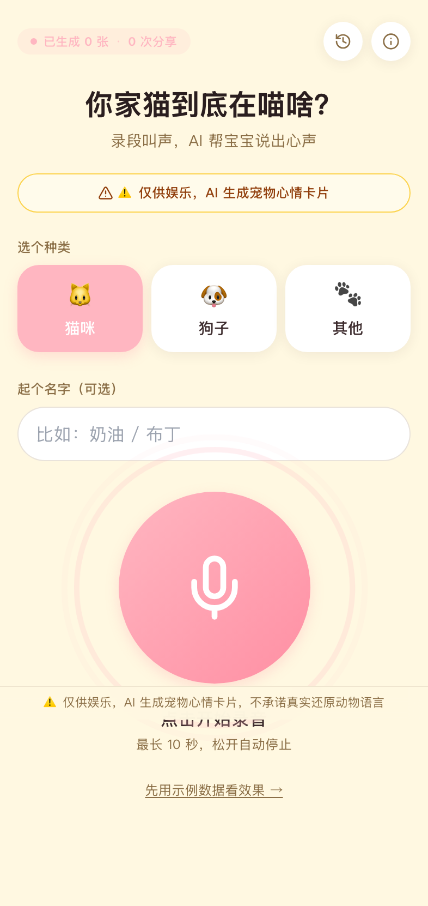
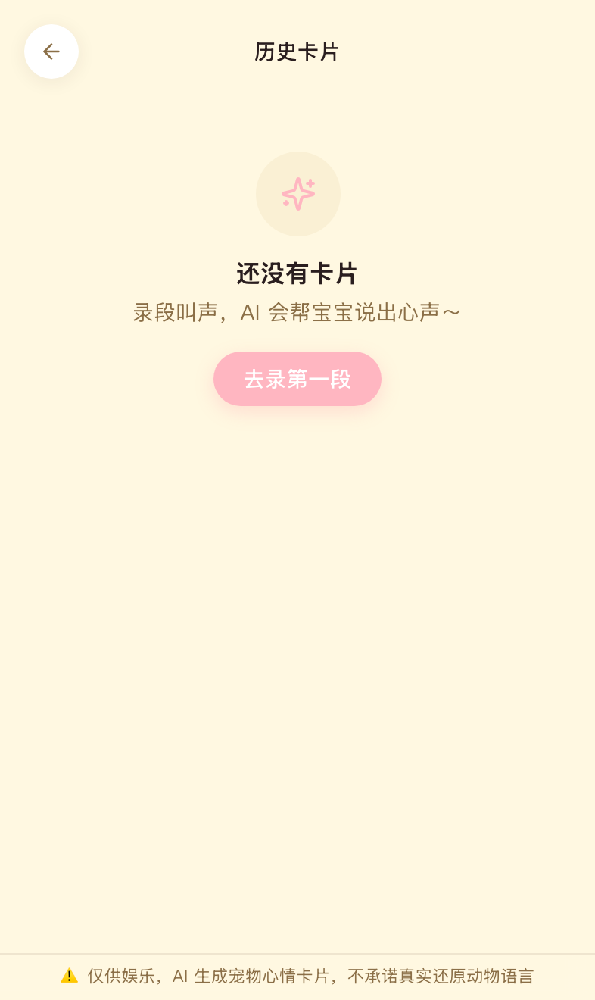
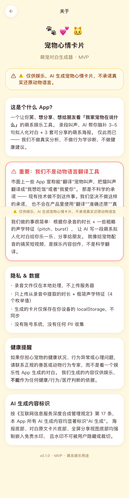

# 05 - 宠物心情卡片 (MVP)

> ⚠️ 仅供娱乐，AI 生成宠物心情卡片，不承诺真实还原动物语言。

原"猜狗翻译器" / "喵语翻译"已按 codex review 强制改名为「宠物心情卡片」/「萌宠对白生成器」。
主卖点：录段宠物叫声，AI 生成 3-5 句萌系拟人化对白 + 3 套可分享海报。

## 📱 手机端截图（iPhone 14 Pro · 393×852）

| 首页（录音入口） | 历史 |
|---|---|
|  |  |
| 口语化萌系主标「你家猫到底在喵啥？」(随宠物种类动态切换：cat=喵啥 / dog="狗子在 BB 啥" / unknown="念叨啥") + 副标「录段叫声，AI 帮宝宝说出心声」· 顶栏双数字 banner「已生成 N 张 · M 次分享」(N/M 为本地真实计数，新用户显示 0)· ⚠️ 醒目 disclaimer 保留 · 猫/狗/其他选择 · 大录音按钮 | localStorage 历史卡片列表 |

| 关于 + 完整 Disclaimer |
|---|
|  |
| 唯一允许出现"翻译"二字的页面 · 全部在免责语境："我们不是动物语言翻译工具" |

> 全站 grep "翻译"：用户面 0 处（仅 about 页免责文案 + 服务端守卫）。
> 真机访问：`PORT=3005 npm run dev`，手机连同 Wi-Fi 后开 `http://<电脑IP>:3005`。
> ⚠️ 真机录音需 HTTPS 或 localhost，浏览器不允许 HTTP IP 站点用 MediaRecorder。建议用 ngrok / cloudflared 暴露 HTTPS。

## 本地运行

```bash
npm install
npm run dev
# 浏览器访问 http://localhost:3000
```

## 环境变量（可选，全部不填走 mock）

```bash
cp .env.example .env.local
# 编辑 .env.local 填入任一 LLM key
```

`lib/llm.ts` 的 provider 优先级：`DEEPSEEK_API_KEY` > `ZHIPU_API_KEY` > `OPENAI_API_KEY` > mock。

## 关键流程

1. 首页：选猫/狗/其他 → 输入名字 → 按下大圆按钮开始录音
2. 录音：MediaRecorder API，最长 10 秒，松开自动停止；不做真实识别，仅本地提取时长 + pitch high/low + burst 三段元信息
3. 提交：POST `/api/generate-cards`，入参 `{ petType, petName, audioDurationSec, audioFeatures }`
4. 结果：3 套海报 tab 切换（萌系卡通 / 简约可爱 / 复古胶片）+ 对白原文 + 一键下载/复制
5. 历史：localStorage 保存最近 100 条

## 已知限制

- MVP 阶段：付费墙未实现（PRD 设计的 ¥1/¥6 IAP 走真实支付要 App Store 审核）
- LLM 调用：默认 mock，配 key 后走真实 API；服务端任何异常都会 fallback 到 mock，绝不 500
- 数据持久化：仅 localStorage，刷新浏览器数据保留，换设备/换浏览器不同步
- 录音：仅 Chrome / Safari / Edge 等支持 MediaRecorder API 的现代浏览器；不支持时显示友好提示并允许走"示例数据"路径
- 占位图：见 `codex-todo-illustrations.md`

## 强制 disclaimer 嵌入位置（codex 硬约束）

| 位置 | 文案 | 实现 |
|---|---|---|
| 全局 footer（每屏底部） | `⚠️ 仅供娱乐，AI 生成宠物心情卡片，不承诺真实还原动物语言` | `app/layout.tsx` |
| 3 套海报底部 | `⚠️ 仅供娱乐，AI 生成宠物心情卡片` | `components/PosterStyle1/2/3.tsx`（不可删除） |
| 结果页对白原文卡 | LLM 返回的 `disclaimer` 字段 | `app/result/[id]/page.tsx`（前端 enforce 标准文案） |
| 首页 hero 下方 | 醒目黄底 disclaimer 横条 | `app/page.tsx` |
| About 页 | 详细娱乐声明 | `app/about/page.tsx` |

## 全站"翻译"二字位置

按 codex 强制约束，「翻译」二字仅可能出现在 `app/about/page.tsx` 的免责声明语境里
（"我们不是翻译工具" / "市面上一些 App 宣称能翻译宠物叫声，但那是不科学的承诺"）。
App 标题 / metadata / 所有海报 / Prompt 输出均不含。

可在仓库根目录跑：
```bash
grep -rn "翻译" --include="*.ts" --include="*.tsx" --include="*.css" .
```

预期只命中 `app/about/page.tsx`、`README.md`、`lib/llm.ts`（禁词清单本身）、`lib/prompt.ts`（禁词清单本身）。

## 部署

```bash
npm run build
vercel deploy  # 或导出 standalone bundle
```

## 合规

参考 `/Users/bytedance/Documents/research/light-products/compliance-checklist.md` § 5️⃣ 节
（5 道产品端 disclaimer 防线 + 3 道 ASO 防线 + 评分管理 SOP）。


---

## iOS / Android 原生壳（Capacitor）

```bash
# 同步 web 资产到原生工程
npm run build
npx cap sync

# 打开 Xcode 工程（需 macOS + Xcode + CocoaPods）
npx cap open ios

# 打开 Android Studio 工程（需 Android Studio + JDK 17 + SDK）
npx cap open android
```

`ios/` 和 `android/` 目录由 `npx cap add ios && npx cap add android` 生成，已入 git；不入 git 的是 `ios/App/Pods/`、`android/build/` 等构建产物（见 .gitignore）。

## OTA 热更新（@capgo/capacitor-updater）

发布新版本 web bundle（不重新提审 App Store）：

```bash
# 1. 提升 version
npm version patch    # 0.0.1 → 0.0.2

# 2. 构建 + 发布到 ota-backend
npm run build
../../scripts/publish-bundle.sh 05-pet-cards $(node -p "require('./package.json').version") dist
```

客户端 (`src/mobileUpdates.ts`) 启动后 2.5s 自动检查更新，下载新 bundle，下次冷启动应用。

需要：
- Cloudflare R2 bucket + KV namespace（mvp/ota-backend 部署后获得）
- `OTA_ADMIN_TOKEN` 环境变量
- 客户端 .env 配置 `VITE_OTA_BACKEND_URL`

详细发布流程见 [`mvp/ota-backend/README.md`](../../../ota-backend/README.md)。
